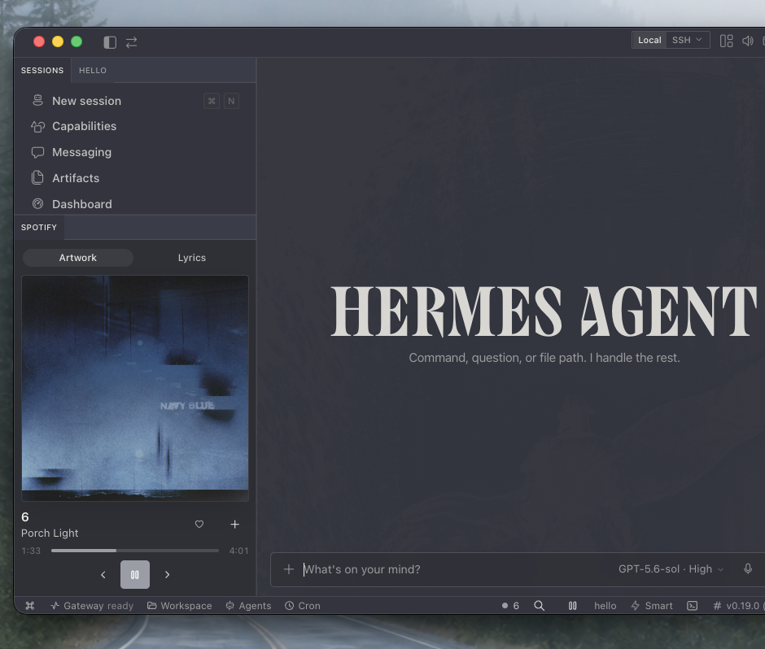

# Hermes Spotify Player

A native Spotify side pocket for [Hermes Desktop](https://hermes-agent.nousresearch.com/docs/user-guide/desktop) on macOS.



It keeps playback inside the desktop workflow without embedding Spotify's Widevine-protected web player. Hermes controls the signed-in Spotify macOS app locally, while its scoped backend uses Hermes' existing Spotify PKCE connection for catalog and library actions.

## Features

- Resizable now-playing pane with artwork and progress
- Play/pause, previous, next, and volume controls
- Search and play tracks from the command palette
- Like/unlike the current track
- Add the current track to a playlist
- Synced lyrics when LRCLIB has a match
- Compact status-bar controller when the pane is closed
- Native Hermes components and theme variables

## Requirements

- macOS
- Hermes Agent **0.19.x** with Hermes Desktop
- Spotify for macOS, signed in
- A Spotify developer Client ID for search, likes, and playlists (the in-app PKCE setup walks through this)

Playback control is local through Spotify's macOS automation interface. Search, library, and playlist actions use Spotify's official Web API through Hermes' built-in Spotify client.

## Install

```bash
hermes plugins install janestreetshiller/hermes-spotify-player --enable
~/.hermes/plugins/spotify-player/scripts/install-desktop.sh
hermes gateway restart
```

Then open Hermes Desktop and run **Cmd+K → Reload desktop plugins**. The player appears below the Sessions pane. You can drag or resize it like any other pane.

Hermes deliberately separates Python gateway plugins from native desktop UI plugins. The first command installs and enables the scoped backend. The script links `desktop/plugin.js` into `$HERMES_HOME/desktop-plugins/spotify-player/` so Hermes Desktop can hot-load it.

### Profiles

Set `HERMES_HOME` before running the installer for a named/custom profile:

```bash
HERMES_HOME="$HOME/.hermes/profiles/work"   "$HOME/.hermes/plugins/spotify-player/scripts/install-desktop.sh"
```

The backend plugin must also be installed and enabled in that profile's Hermes home.

## Connect Spotify

Open the Spotify connection dialog from the status bar. First-time setup asks for a Spotify Client ID and shows the exact redirect URI:

```text
http://127.0.0.1:43827/spotify/callback
```

Hermes uses PKCE. No Spotify client secret or Spotify password is stored by this plugin.

The setup dialog reads Hermes' configured redirect URI, including a custom `HERMES_SPOTIFY_REDIRECT_URI`, instead of assuming the default callback.

## Privacy and network access

- No telemetry or analytics.
- Local playback commands go to the installed Spotify macOS app through `/usr/bin/osascript`.
- Search, library, playlist, and authorization calls go to Spotify through Hermes' built-in Spotify client.
- Lyrics requests send track title, artist, album, and duration to [LRCLIB](https://lrclib.net/). Lyrics are cached in memory for the running gateway process.

See [PRIVACY.md](PRIVACY.md) for the exact data flow.

## Update

```bash
hermes plugins update spotify-player
hermes gateway restart
```

The desktop file is symlinked into the installed repository, so it follows plugin updates automatically. Use **Cmd+K → Reload desktop plugins** if the UI does not hot-reload.

## Uninstall

```bash
~/.hermes/plugins/spotify-player/scripts/uninstall-desktop.sh
hermes plugins disable spotify-player
hermes plugins remove spotify-player
```

## Development and tests

```bash
./scripts/test.sh
```

For a live smoke test:

```bash
/usr/bin/osascript -l JavaScript dashboard/spotify_control.js status
```

## Security

The backend allow-lists actions, validates Spotify URIs and playlist IDs, uses fixed executable paths, and calls subprocesses without a shell. The desktop UI reaches only its scoped `/api/plugins/spotify-player` REST namespace.

Report vulnerabilities through GitHub's private security advisory flow. See [SECURITY.md](SECURITY.md).

## License

MIT
