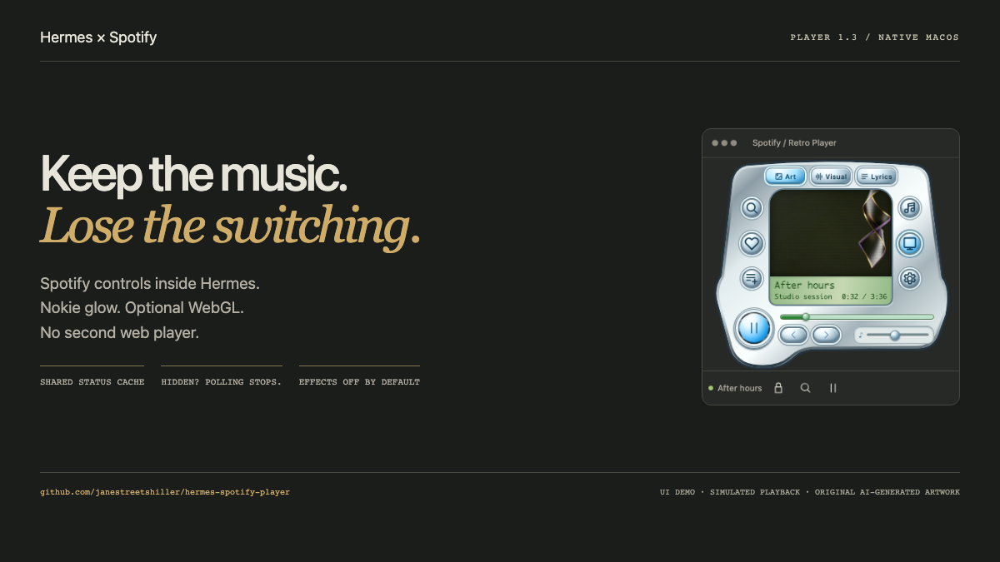

# Hermes Spotify Player

A native Spotify side pocket for [Hermes Desktop](https://hermes-agent.nousresearch.com/docs/user-guide/desktop) on macOS.



*Product UI rendered from this candidate with demo tracks and generated artwork.*

[Interactive demo](https://janestreetshiller.github.io/hermes-spotify-player/demo/) · [Release/install verification](docs/INSTALL-VERIFICATION.md) · [Privacy](PRIVACY.md)

It keeps playback inside the desktop workflow without embedding Spotify's Widevine-protected web player. Hermes controls the signed-in Spotify macOS app locally, while its scoped backend uses Hermes' existing Spotify PKCE connection for catalog and library actions.

## 1.3 release candidate

This release candidate contains the current player layouts and single-screen digital menus. Automated tests use the production renderer with explicitly synthetic account data; they do not certify another person's OAuth approval or macOS permission dialogs. See [verification and install boundaries](docs/INSTALL-VERIFICATION.md). iPod players, Spotify DNA integration, and the separate TERMIN8 prototype are not included.

## Features

- One-click **screen-on / screen-off**, each auto-fitted to its scaled shell and host header
- Original silver player with full, screen-off and compact mini modes; proportion-preserving frame sizing
- Persistent reference-layout picker, separate from Classic chrome / Ice blue / Graphite finishes; [complete source-image accounting and adaptation limits](docs/reference-styles.json)
- Silver settings and metadata retain a 10px logical font floor at tested narrow widths; compact height has a 70px readability floor
- Artwork, themed lyrics, or opt-in audio-driven Spectrum, Scope and Alchemy-inspired visualizers ([source and limits](docs/AUDIO-VISUALIZERS.md))
- Play/pause, previous, next, seek, and volume controls
- One shared status cache: 4s playing / 15s paused / 30s stopped or error; no hidden-window status polling
- Nokie-inspired finite focus glow and CSS-only Web Design Factory-style loading bars
- Default **Alloy / metal-fx@1.0.4** silver ring on play/pause, from the linked Artifact Library: actual upstream shader/renderer, 12fps cap, 96×96 shared GPU buffer, DPR 1; released when paused, hidden, offscreen, reduced-motion, or collapsed
- Search and play tracks inside the screen or from the command palette
- Like/unlike the current track, with automatic liked-state lookup and distinct loading/disconnected indicators
- Add a track to a playlist; the picker pins the displayed song so playback changes cannot silently replace the selection
- **Taste palette** side control: private playlist creation, batch like/unlike, recent-liked sample count, and a copyable prompt from your brief/seeds
- Every menu occupies one padded display screen: explicit pages replace scrolling; flat text controls inside the display never reuse physical frame-button chrome
- `spotify_player_curate`: single-call creation from exact song names or track URIs, verified reads after writes, and retry protection ([usage](docs/CURATION.md))
- Synced lyrics when LRCLIB has a match
- Compact status-bar controller when the pane is closed
- Native Hermes components and theme variables

## Requirements

- macOS
- Hermes Agent **0.21.x** with Hermes Desktop and the documented `useQuery`/`queryClient` plugin SDK exports; tested against `f159e581c7`
- Spotify **1.2.98.301** tested on macOS 27 ARM64 (matches Homebrew metadata at verification)
- Spotify for macOS, signed in
- **Your own** Spotify developer Client ID and Spotify account for search, likes, and playlists (the in-app PKCE setup walks through this); Spotify's current developer-app/account restrictions apply
- Optional audio visualizers: macOS 13+, Xcode Command Line Tools to compile the local helper, and macOS Screen & System Audio Recording permission. Ordinary controls do not require audio capture or its compiler.

The silver design space is 320×280. Its shell scales with content width while settings/metadata keep a 10px logical font floor; mini mode reserves at least 70px height. Reference application layouts expand up to 720px and reveal independent playlist-target panels at 480px where applicable. Narrow layouts retain the same actions without squeezing three columns together. Fixtures cover 234px and wider hosts; geometric/typographic checks do not replace native or reference-fidelity acceptance.

Playback control is local through Spotify's macOS automation interface. Search, library, and playlist actions use Spotify's official Web API through Hermes' built-in Spotify client.

## Your Spotify account, not the author's

No Spotify Client ID, token, password, client secret, account profile, or curation database is bundled. Native transport controls whichever account **you** have signed into in Spotify for macOS. Web API actions use **your active Hermes profile's** OAuth connection.

For a new connection, open **Player settings → Spotify connection → Set up your Spotify app**, create a Web API app in [your Spotify developer dashboard](https://developer.spotify.com/dashboard), and register `http://127.0.0.1:43827/spotify/callback` exactly. Return to the player, paste your app's **Client ID** (not its secret), then select **Connect Spotify** and authorize your own account in Spotify's browser page. Match that account to the one in the Spotify desktop app. Do not copy the author's or another user's `auth.json`, `.env`, or profile directory. An existing profile connection is reused, never replaced on install.

## Install

Install the tested 1.3 candidate at this exact revision. The default branch may still contain an earlier version. This requires a Hermes CLI with `plugins install --ref` support. See [fresh-install results and security-scan guidance](docs/INSTALL-VERIFICATION.md).

```bash
hermes plugins install janestreetshiller/hermes-spotify-player \
  --ref 93f6e00a9e8123f8a900a7aa08dfc45456e649ab --enable
"${HERMES_HOME:-$HOME/.hermes}/plugins/spotify-player/scripts/install-desktop.sh"
```

The tested fresh install showed a security scan confirmation for local macOS command execution, the localhost OAuth callback, bundled demo code/media, and a CSS comment false-positive. Review the findings and approve only if you trust this pinned source. A non-interactive install stops when that confirmation is required; do not disable scanning globally.

If Spotify Player is already installed, use the same command with `--force` to replace its checkout. Save any local plugin source edits first.

Then **quit and reopen Hermes Desktop after saving active work** so its own `hermes serve` backend mounts the newly installed routes. Restarting the messaging gateway alone does not refresh an already-running Desktop backend. Open **Settings → Plugins** and enable **Spotify Player** if its saved desktop toggle is off. Quit and reopen Desktop after updates as well; the reload command may only discover newly installed plugins. The player appears below the Sessions pane. You can move it like any other pane; the screen toggle automatically fits its vertical allocation, and width changes resize the selected layout; the silver shell scales without shrinking settings/metadata below their logical font floor.

Hermes deliberately separates Python gateway plugins from native desktop UI plugins. The first command installs and enables the scoped backend. The script links `desktop/plugin.js` into `$HERMES_HOME/desktop-plugins/spotify-player/` so Hermes Desktop can hot-load it.

### Profiles

Set `HERMES_HOME` before running the installer for a named/custom profile:

```bash
export HERMES_HOME="$HOME/.hermes/profiles/work"
hermes plugins install janestreetshiller/hermes-spotify-player \
  --ref 93f6e00a9e8123f8a900a7aa08dfc45456e649ab --enable
"$HERMES_HOME/plugins/spotify-player/scripts/install-desktop.sh"
```

The backend plugin must also be installed and enabled in that profile's Hermes home.

## Connect Spotify

Open the Spotify connection dialog from the status bar. First-time setup asks for a Spotify Client ID and shows the exact redirect URI:

```text
http://127.0.0.1:43827/spotify/callback
```

Hermes uses PKCE. No Spotify client secret or Spotify password is stored by this plugin.

The setup dialog reads Hermes' configured redirect URI, including a custom `HERMES_SPOTIFY_REDIRECT_URI`, instead of assuming the default callback.

## Privacy and network access

- No telemetry or analytics.
- Audio analysis is off until **Enable audio** is selected. ScreenCaptureKit is configured for the Spotify app, with no microphone or screen-frame output. Derived spectrum/waveform data stays between the local helper, scoped backend and player UI; no audio recording is saved or uploaded.
- A session-scoped helper stops when the visualizer is stopped, paused, hidden, collapsed or motion-reduced; abandoned viewer leases expire after five seconds.
- Local playback commands go to the installed Spotify macOS app through `/usr/bin/osascript`.
- Search, library, playlist, and authorization calls go to Spotify through Hermes' built-in Spotify client.
- Lyrics requests send track title, artist, album, and duration to [LRCLIB](https://lrclib.net/). Lyrics are cached in memory for the running gateway process.

See [PRIVACY.md](PRIVACY.md) for the exact data flow.

## Update

The candidate install above is pinned: `hermes plugins update spotify-player` intentionally will not move it. To install a newer candidate, use its documented full commit SHA with `hermes plugins install … --ref … --force --enable`, then run its desktop installer again. Save local source edits before force-reinstalling.

For an unpinned default-branch installation, use `hermes plugins update spotify-player` instead.

Reopen Hermes Desktop after updates. The desktop file is symlinked into the installed repository, so it follows plugin updates automatically. Quit and reopen Desktop if the UI does not hot-reload.

## Uninstall

```bash
~/.hermes/plugins/spotify-player/scripts/uninstall-desktop.sh
hermes plugins disable spotify-player
hermes plugins remove spotify-player
```

## Development and tests

```bash
./scripts/test.sh
npm ci --include=dev
npx playwright install chromium
npm run demo:build
npm run test:browser  # includes audio and focus/motion fixture regressions
npm run test:stress
npm run demo:media  # needs ffmpeg
npm run poster:render  # portrait + landscape from the supplied base image
# Opt-in: briefly changes and restores native playback
npm run test:native
```

For a live smoke test:

```bash
/usr/bin/osascript -l JavaScript dashboard/spotify_control.js status
```

## Compatibility and resource boundaries

The Nokie reference is its current 0.1.0 desktop design (remote main `e5ddecb70e40`, local style source inspected without editing it). This remains a **Hermes plugin**, not a Nokie/Tauri plugin or a claimed Nokie SDK integration. No Nokie runtime dependencies are bundled.

The installed plugin reuses Hermes React and React Query. Demo-only npm dependencies are not required at runtime. The Alloy WebGL play-button ring remains decorative; the separate canvas visualizers consume measured Spotify audio. There is no microphone use, playback SDK, embedded Spotify site or analytics. Ordinary controls use transient `osascript` commands. Explicit audio analysis additionally compiles/caches and launches a bounded, session-scoped native helper; it is not an always-on service. The status bar remains active if the pane closes.

Audio frames are capped at 12Hz, with one in-flight client request and stale-data clearing. Missing permission/source/compiler is reported rather than replaced with ambient activity. OS reduced motion, and a host-supplied reduction preference where available, disable visualizer/GPU activity. Runtime CPU/RSS and final native Hermes-window acceptance for this continuation remain release gates; no cross-version macOS certification is claimed from the deployment target alone.

Spotify search, likes, and playlist APIs require separate PKCE authorization and applicable Spotify account/app access. Current `/me/library`, `/me/library/contains`, and playlist `/items` routes replace removed convenience methods in Hermes. API errors are surfaced rather than retried aggressively. No claim of live OAuth verification is made without a connected account.

## Security

The backend allow-lists actions, validates Spotify URIs and playlist IDs, uses fixed executable paths, and calls subprocesses without a shell. The desktop UI reaches only its scoped `/api/plugins/spotify-player` REST namespace.

Report vulnerabilities through GitHub's private security advisory flow. See [SECURITY.md](SECURITY.md).

## License

MIT
