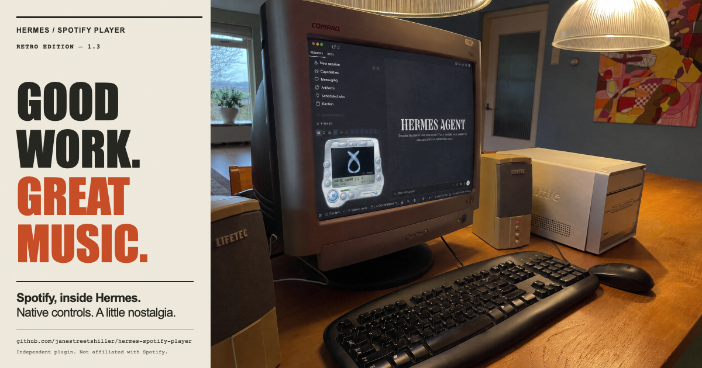

# Retro Player 1.3 — social package

## Short post

Good work. Great music.

A little nostalgia for your agent desktop. Hermes Spotify Player brings native playback controls, lyrics and a chrome faceplate into Hermes on macOS. Buttons on the shell. Menus in the screen.

Open source: https://github.com/janestreetshiller/hermes-spotify-player

## Longer caption

Spotify, inside Hermes.

A retro silver player beside your work: play/pause, skip, seek and volume; artwork, lyrics and an ambient visualizer; search and playlist panels inside the display. Default chrome feedback, compact text-only settings, and a heart that checks each song automatically instead of guessing its liked state.

Local playback controls the Spotify macOS app—no embedded web player. Search, likes and playlists require separate Spotify PKCE authorization and applicable account/app access. The live account-dependent flows still await verification; automated integration tests use controlled responses. The visualizer is decorative, not audio-reactive.

Code: https://github.com/janestreetshiller/hermes-spotify-player
Demo: https://janestreetshiller.github.io/hermes-spotify-player/demo/

Independent open-source plugin. Not affiliated with Spotify.

## Artwork and exports

- [Portrait poster](media/retro-poster.png): 1080×1350, 4:5 feed/poster layout.
- [Landscape social card](media/retro-social.png): 1200×630, link-sharing layout.
- [Editable HTML composition](media/retro-poster.html).
- [Original user-supplied base](media/retro-poster-base.png), preserved byte-for-byte.
- [Current UI demo video](media/player-1.3-demo.mp4): silent recording of production UI through the demo adapter, with simulated playback.

The supplied base is the user's retro Compaq desk artwork. It is **concept art**, not proof of supported hardware or a live Spotify session. No product controls were generated or replaced in the artwork. Cream paper, condensed type, orange ink and a subtle print texture frame the original image; the computer scene is not cropped.

Alt text: “Good work. Great music. Hermes Spotify Player poster on cream paper with orange and black condensed lettering. A Compaq CRT shows Hermes and a silver player, surrounded by beige speakers, a computer and a keyboard on a warm wooden desk.”

Rebuild from the repository root with `npm run poster:render`. The renderer uses local assets and checks image decoding, page errors, bounds and content separation. Typography uses Impact when installed (macOS render); other systems may use the declared fallback. Committed PNGs are the canonical exports.

Publication status: assets and copy included in the repository and PR. Not posted to any social account; no destination/account was specified. GitHub Pages is already configured to publish `/docs` from `feat/low-resource-nokie-player`; the live social image and demo HTML were fetched and matched these committed files.
